# CueFinder — Flow Diagrams

---

## 1. Authentication Flows

### 1.1 Login

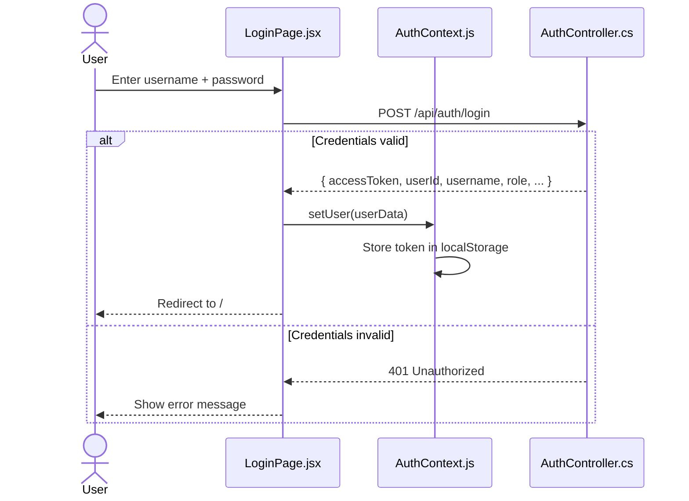
```mermaid
sequenceDiagram
    actor User
    participant FE as LoginPage.jsx
    participant AC as AuthContext.js
    participant BE as AuthController.cs

    User->>FE: Enter username + password
    FE->>BE: POST /api/auth/login
    alt Credentials valid
        BE-->>FE: { accessToken, userId, username, role, ... }
        FE->>AC: setUser(userData)
        AC->>AC: Store token in localStorage
        FE-->>User: Redirect to /
    else Credentials invalid
        BE-->>FE: 401 Unauthorized
        FE-->>User: Show error message
    end
```

---

### 1.2 Registration + Phone Verification

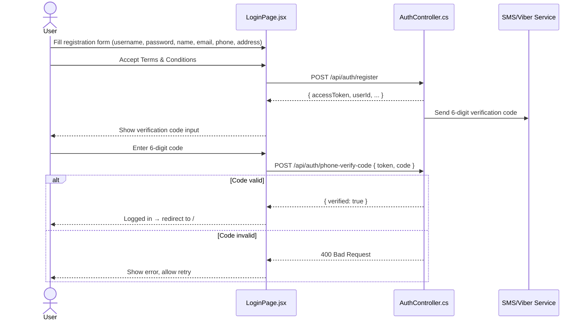
```mermaid
sequenceDiagram
    actor User
    participant FE as LoginPage.jsx
    participant BE as AuthController.cs
    participant SMS as SMS/Viber Service

    User->>FE: Fill registration form (username, password, name, email, phone, address)
    User->>FE: Accept Terms & Conditions
    FE->>BE: POST /api/auth/register
    BE-->>FE: { accessToken, userId, ... }
    BE->>SMS: Send 6-digit verification code
    FE-->>User: Show verification code input
    User->>FE: Enter 6-digit code
    FE->>BE: POST /api/auth/phone-verify-code { token, code }
    alt Code valid
        BE-->>FE: { verified: true }
        FE-->>User: Logged in → redirect to /
    else Code invalid
        BE-->>FE: 400 Bad Request
        FE-->>User: Show error, allow retry
    end
```

---

### 1.3 External Login (Google / Apple OAuth)

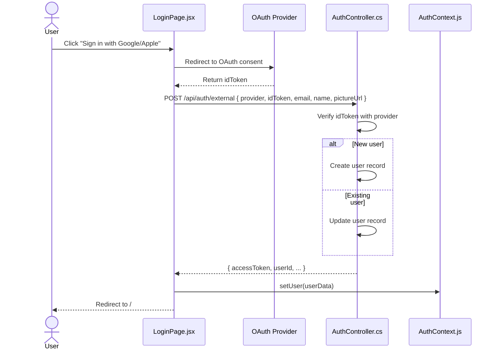
```mermaid
sequenceDiagram
    actor User
    participant FE as LoginPage.jsx
    participant OAuth as OAuth Provider
    participant BE as AuthController.cs
    participant AC as AuthContext.js

    User->>FE: Click "Sign in with Google/Apple"
    FE->>OAuth: Redirect to OAuth consent
    OAuth-->>FE: Return idToken
    FE->>BE: POST /api/auth/external { provider, idToken, email, name, pictureUrl }
    BE->>BE: Verify idToken with provider
    alt New user
        BE->>BE: Create user record
    else Existing user
        BE->>BE: Update user record
    end
    BE-->>FE: { accessToken, userId, ... }
    FE->>AC: setUser(userData)
    FE-->>User: Redirect to /
```

---

### 1.4 Password Reset

```mermaid
flowchart TD
    A([User clicks Forgot Password]) --> B[Enter email or username]
    B --> C[POST /api/auth/forgot-password]
    C --> D{User found?}
    D -- No --> E[Generic success message\nno email sent]
    D -- Yes --> F[Generate reset token\nvalid 30 min]
    F --> G[Send reset email with link]
    G --> H([User clicks link in email])
    H --> I[/reset-password?token=XXX]
    I --> J[POST /api/auth/validate-reset-token]
    J --> K{Token valid?}
    K -- No/Expired --> L[Show error: link expired]
    K -- Yes --> M[Show new password form]
    M --> N[Enter new password + confirmation]
    N --> O[POST /api/auth/reset-password]
    O --> P([Password updated → redirect to login])
```

---

### 1.5 Profile Management

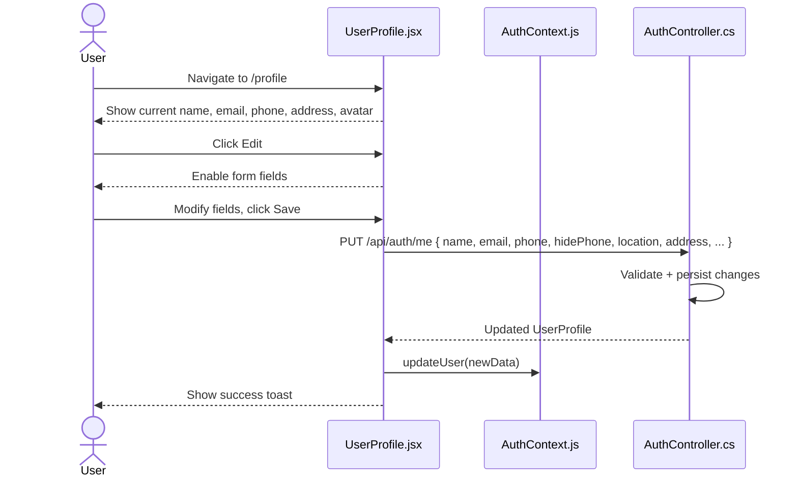
```mermaid
sequenceDiagram
    actor User
    participant FE as UserProfile.jsx
    participant AC as AuthContext.js
    participant BE as AuthController.cs

    User->>FE: Navigate to /profile
    FE-->>User: Show current name, email, phone, address, avatar
    User->>FE: Click Edit
    FE-->>User: Enable form fields
    User->>FE: Modify fields, click Save
    FE->>BE: PUT /api/auth/me { name, email, phone, hidePhone, location, address, ... }
    BE->>BE: Validate + persist changes
    BE-->>FE: Updated UserProfile
    FE->>AC: updateUser(newData)
    FE-->>User: Show success toast
```

---

## 2. Listing Management

### 2.1 Browse Listings

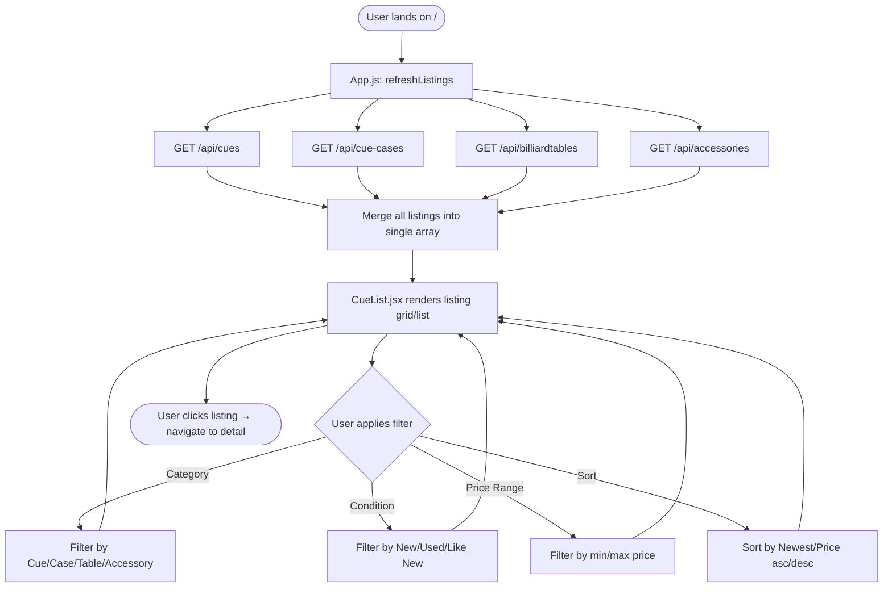
```mermaid
flowchart TD
    A([User lands on /]) --> B[App.js: refreshListings]
    B --> C1[GET /api/cues]
    B --> C2[GET /api/cue-cases]
    B --> C3[GET /api/billiardtables]
    B --> C4[GET /api/accessories]
    C1 & C2 & C3 & C4 --> D[Merge all listings into single array]
    D --> E[CueList.jsx renders listing grid/list]
    E --> F{User applies filter}
    F -- Category --> G[Filter by Cue/Case/Table/Accessory]
    F -- Condition --> H[Filter by New/Used/Like New]
    F -- Price Range --> I[Filter by min/max price]
    F -- Sort --> J[Sort by Newest/Price asc/desc]
    G & H & I & J --> E
    E --> K([User clicks listing → navigate to detail])
```

---

### 2.2 Create Listing (4-Step Wizard)

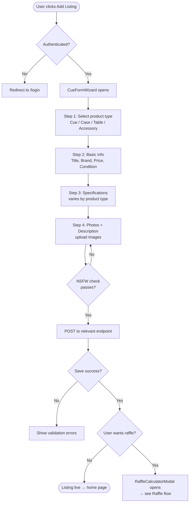
```mermaid
flowchart TD
    A([User clicks Add Listing]) --> B{Authenticated?}
    B -- No --> C[Redirect to /login]
    B -- Yes --> D[CueFormWizard opens]
    D --> S1[Step 1: Select product type\nCue / Case / Table / Accessory]
    S1 --> S2[Step 2: Basic info\nTitle, Brand, Price, Condition]
    S2 --> S3[Step 3: Specifications\nvaries by product type]
    S3 --> S4[Step 4: Photos + Description\nupload images]
    S4 --> V{NSFW check\npasses?}
    V -- No --> S4
    V -- Yes --> E[POST to relevant endpoint]
    E --> F{Save success?}
    F -- No --> G[Show validation errors]
    F -- Yes --> H{User wants raffle?}
    H -- No --> I([Listing live → home page])
    H -- Yes --> J[RaffleCalculatorModal opens\n→ see Raffle flow]
```

---

### 2.3 View Listing Detail

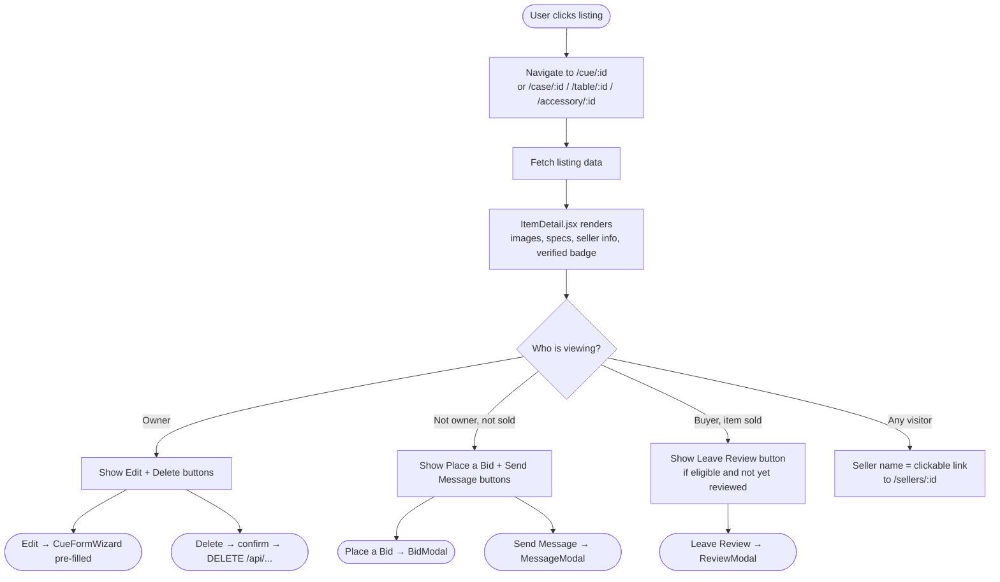
```mermaid
flowchart TD
    A([User clicks listing]) --> B[Navigate to /cue/:id\nor /case/:id / /table/:id / /accessory/:id]
    B --> C[Fetch listing data]
    C --> D[ItemDetail.jsx renders\nimages, specs, seller info, verified badge]
    D --> E{Who is viewing?}
    E -- Owner --> F[Show Edit + Delete buttons]
    E -- Not owner, not sold --> G[Show Place a Bid + Send Message buttons]
    E -- Buyer, item sold --> H[Show Leave Review button\nif eligible and not yet reviewed]
    E -- Any visitor --> I[Seller name = clickable link\nto /sellers/:id]
    F --> J([Edit → CueFormWizard pre-filled])
    F --> K([Delete → confirm → DELETE /api/...])
    G --> L([Place a Bid → BidModal])
    G --> M([Send Message → MessageModal])
    H --> N([Leave Review → ReviewModal])
```

---

### 2.4 Old Listings Management

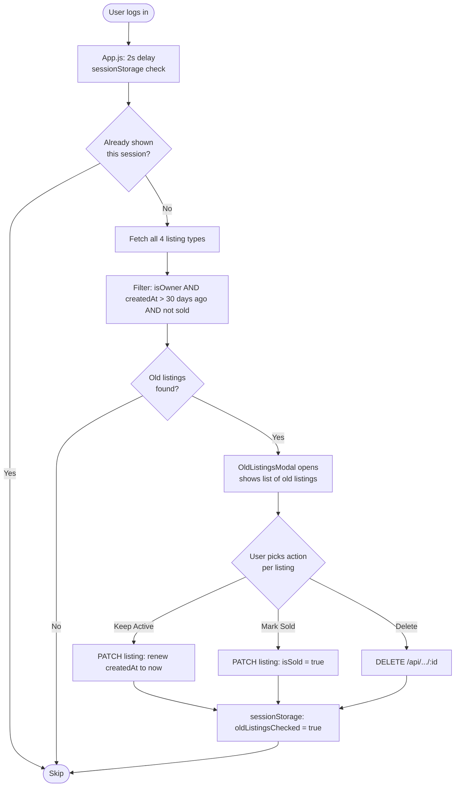
```mermaid
flowchart TD
    A([User logs in]) --> B[App.js: 2s delay\nsessionStorage check]
    B --> C{Already shown\nthis session?}
    C -- Yes --> D([Skip])
    C -- No --> E[Fetch all 4 listing types]
    E --> F[Filter: isOwner AND createdAt > 30 days ago AND not sold]
    F --> G{Old listings\nfound?}
    G -- No --> D
    G -- Yes --> H[OldListingsModal opens\nshows list of old listings]
    H --> I{User picks action\nper listing}
    I -- Keep Active --> J[PATCH listing: renew createdAt to now]
    I -- Mark Sold --> K[PATCH listing: isSold = true]
    I -- Delete --> L[DELETE /api/.../:id]
    J & K & L --> M[sessionStorage: oldListingsChecked = true]
    M --> D
```

---

## 3. Messaging & Bidding

### 3.1 Send Message to Seller

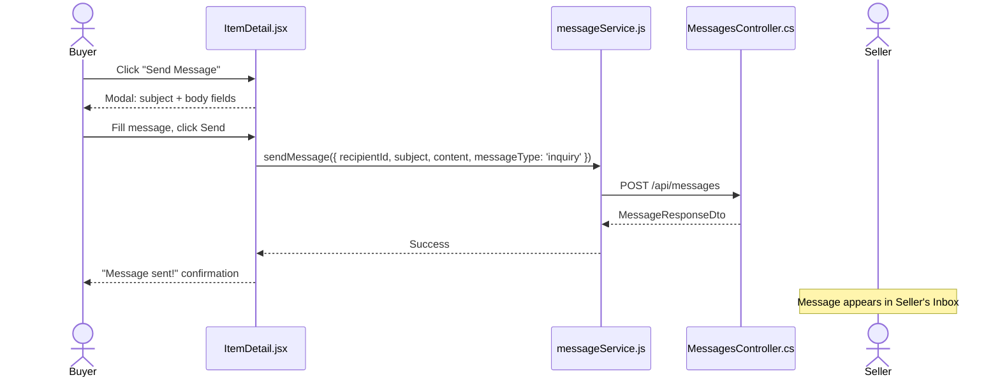
```mermaid
sequenceDiagram
    actor Buyer
    participant FE as ItemDetail.jsx
    participant MS as messageService.js
    participant BE as MessagesController.cs
    actor Seller

    Buyer->>FE: Click "Send Message"
    FE-->>Buyer: Modal: subject + body fields
    Buyer->>FE: Fill message, click Send
    FE->>MS: sendMessage({ recipientId, subject, content, messageType: 'inquiry' })
    MS->>BE: POST /api/messages
    BE-->>MS: MessageResponseDto
    MS-->>FE: Success
    FE-->>Buyer: "Message sent!" confirmation
    Note over Seller: Message appears in Seller's Inbox
```

---

### 3.2 Place a Bid

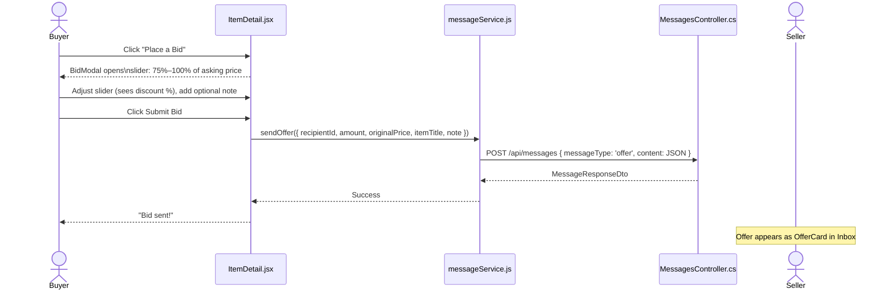
```mermaid
sequenceDiagram
    actor Buyer
    participant FE as ItemDetail.jsx
    participant MS as messageService.js
    participant BE as MessagesController.cs
    actor Seller

    Buyer->>FE: Click "Place a Bid"
    FE-->>Buyer: BidModal opens\nslider: 75%–100% of asking price
    Buyer->>FE: Adjust slider (sees discount %), add optional note
    Buyer->>FE: Click Submit Bid
    FE->>MS: sendOffer({ recipientId, amount, originalPrice, itemTitle, note })
    MS->>BE: POST /api/messages { messageType: 'offer', content: JSON }
    BE-->>MS: MessageResponseDto
    MS-->>FE: Success
    FE-->>Buyer: "Bid sent!"
    Note over Seller: Offer appears as OfferCard in Inbox
```

---

### 3.3 Offer Response Flow

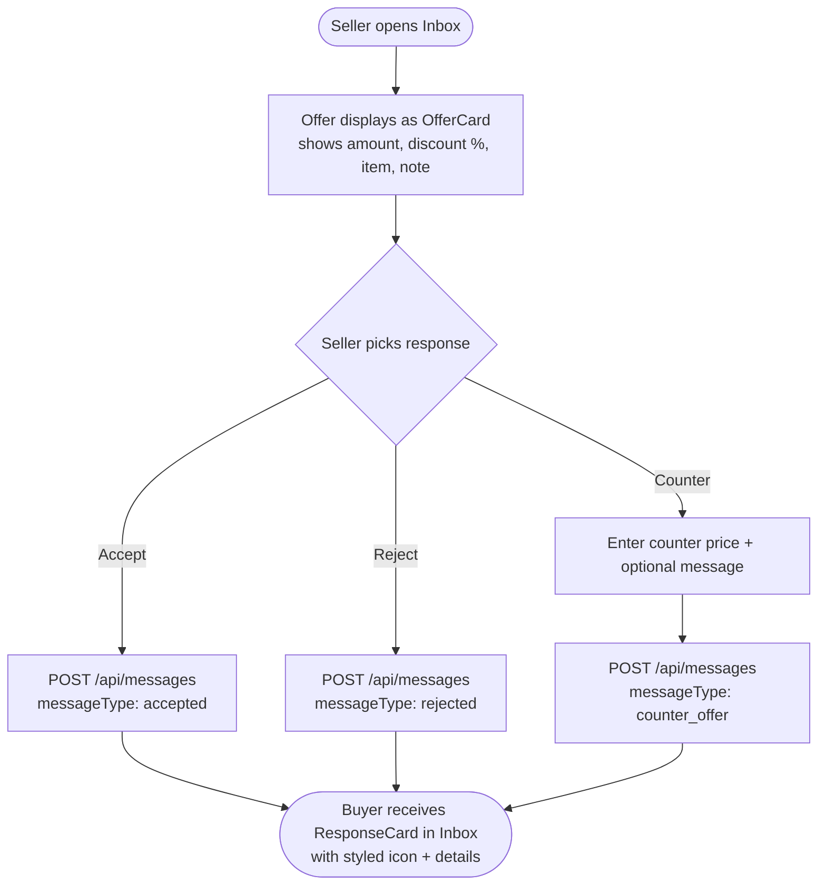
```mermaid
flowchart TD
    A([Seller opens Inbox]) --> B[Offer displays as OfferCard\nshows amount, discount %, item, note]
    B --> C{Seller picks response}
    C -- Accept --> D[POST /api/messages\nmessageType: accepted]
    C -- Reject --> E[POST /api/messages\nmessageType: rejected]
    C -- Counter --> F[Enter counter price + optional message]
    F --> G[POST /api/messages\nmessageType: counter_offer]
    D & E & G --> H([Buyer receives ResponseCard in Inbox\nwith styled icon + details])
```

---

### 3.4 Inbox & Unread Polling

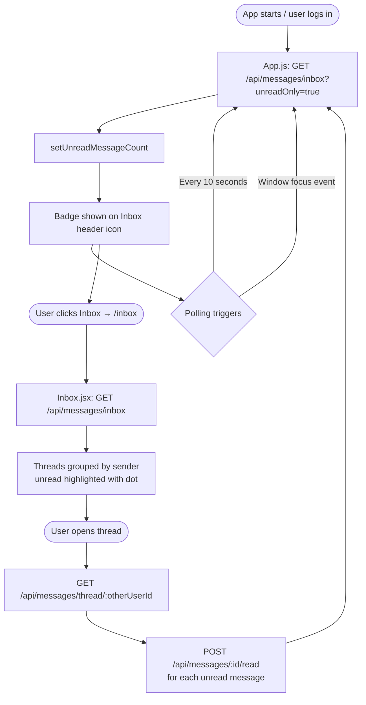
```mermaid
flowchart TD
    A([App starts / user logs in]) --> B[App.js: GET /api/messages/inbox?unreadOnly=true]
    B --> C[setUnreadMessageCount]
    C --> D[Badge shown on Inbox header icon]
    D --> E{Polling triggers}
    E -- Every 10 seconds --> B
    E -- Window focus event --> B
    D --> F([User clicks Inbox → /inbox])
    F --> G[Inbox.jsx: GET /api/messages/inbox]
    G --> H[Threads grouped by sender\nunread highlighted with dot]
    H --> I([User opens thread])
    I --> J[GET /api/messages/thread/:otherUserId]
    J --> K[POST /api/messages/:id/read\nfor each unread message]
    K --> B
```

---

## 4. Raffle System

### 4.1 Create Raffle

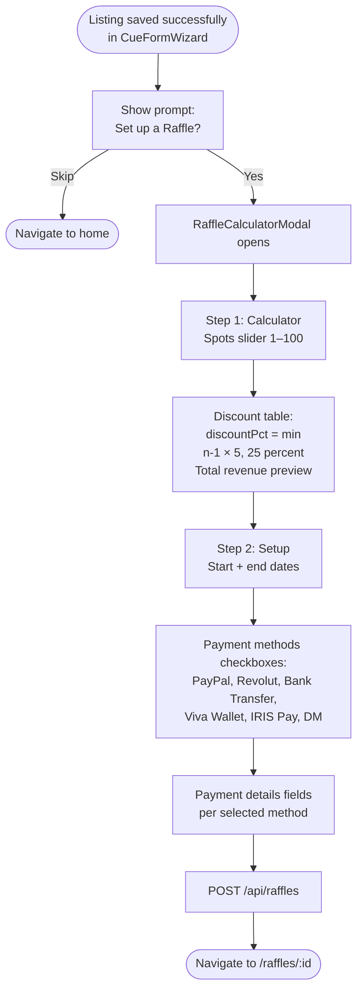
```mermaid
flowchart TD
    A([Listing saved successfully\nin CueFormWizard]) --> B[Show prompt:\nSet up a Raffle?]
    B -- Skip --> C([Navigate to home])
    B -- Yes --> D[RaffleCalculatorModal opens]
    D --> E[Step 1: Calculator\nSpots slider 1–100]
    E --> F[Discount table:\ndiscountPct = min\nn-1 × 5, 25 percent\nTotal revenue preview]
    F --> G[Step 2: Setup\nStart + end dates]
    G --> H[Payment methods checkboxes:\nPayPal, Revolut, Bank Transfer,\nViva Wallet, IRIS Pay, DM]
    H --> I[Payment details fields\nper selected method]
    I --> J[POST /api/raffles]
    J --> K([Navigate to /raffles/:id])
```

---

### 4.2 Raffle Lifecycle

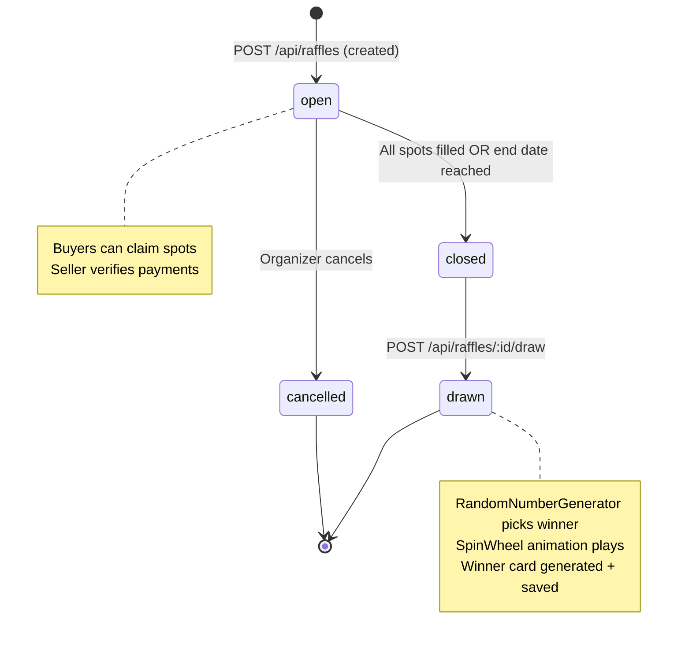
```mermaid
stateDiagram-v2
    [*] --> open : POST /api/raffles (created)
    open --> closed : All spots filled OR end date reached
    open --> cancelled : Organizer cancels
    closed --> drawn : POST /api/raffles/:id/draw
    drawn --> [*]
    cancelled --> [*]

    note right of open
        Buyers can claim spots
        Seller verifies payments
    end note

    note right of drawn
        RandomNumberGenerator picks winner
        SpinWheel animation plays
        Winner card generated + saved
    end note
```

---

### 4.3 Enter Raffle & Payment Verification

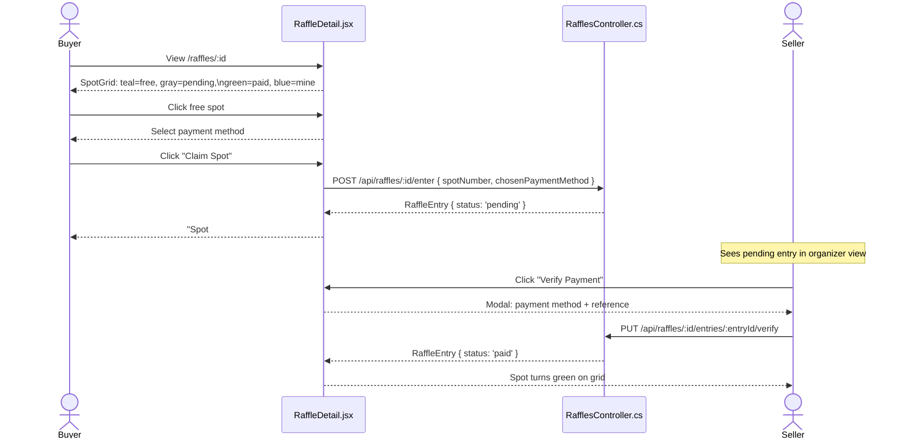
```mermaid
sequenceDiagram
    actor Buyer
    participant FE as RaffleDetail.jsx
    participant BE as RafflesController.cs
    actor Seller

    Buyer->>FE: View /raffles/:id
    FE-->>Buyer: SpotGrid: teal=free, gray=pending,\ngreen=paid, blue=mine
    Buyer->>FE: Click free spot
    FE-->>Buyer: Select payment method
    Buyer->>FE: Click "Claim Spot"
    FE->>BE: POST /api/raffles/:id/enter { spotNumber, chosenPaymentMethod }
    BE-->>FE: RaffleEntry { status: 'pending' }
    FE-->>Buyer: "Spot #N claimed! 36h to pay."
    Note over Seller: Sees pending entry in organizer view
    Seller->>FE: Click "Verify Payment"
    FE-->>Seller: Modal: payment method + reference
    Seller->>BE: PUT /api/raffles/:id/entries/:entryId/verify
    BE-->>FE: RaffleEntry { status: 'paid' }
    FE-->>Seller: Spot turns green on grid
```

---

### 4.4 Draw Winner

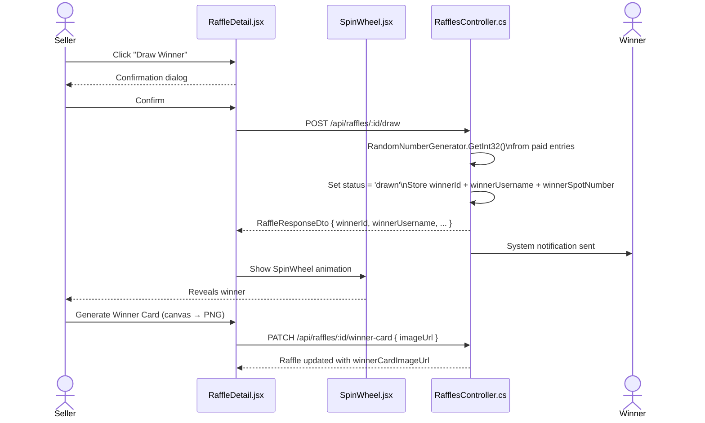
```mermaid
sequenceDiagram
    actor Seller
    participant FE as RaffleDetail.jsx
    participant SW as SpinWheel.jsx
    participant BE as RafflesController.cs
    actor Winner

    Seller->>FE: Click "Draw Winner"
    FE-->>Seller: Confirmation dialog
    Seller->>FE: Confirm
    FE->>BE: POST /api/raffles/:id/draw
    BE->>BE: RandomNumberGenerator.GetInt32()\nfrom paid entries
    BE->>BE: Set status = 'drawn'\nStore winnerId + winnerUsername + winnerSpotNumber
    BE-->>FE: RaffleResponseDto { winnerId, winnerUsername, ... }
    BE->>Winner: System notification sent
    FE->>SW: Show SpinWheel animation
    SW-->>Seller: Reveals winner
    Seller->>FE: Generate Winner Card (canvas → PNG)
    FE->>BE: PATCH /api/raffles/:id/winner-card { imageUrl }
    BE-->>FE: Raffle updated with winnerCardImageUrl
```

---

## 5. Seller Profiles & Reviews

### 5.1 Seller Profile

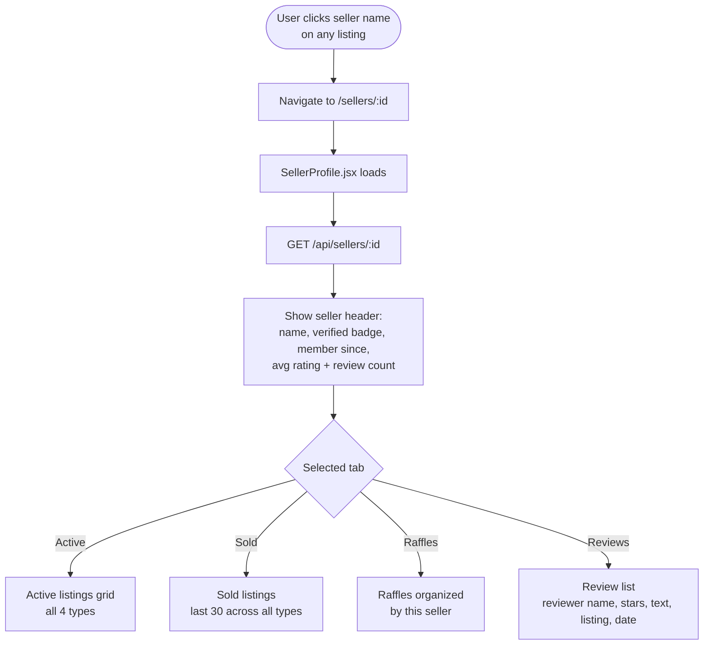
```mermaid
flowchart TD
    A([User clicks seller name\non any listing]) --> B[Navigate to /sellers/:id]
    B --> C[SellerProfile.jsx loads]
    C --> D[GET /api/sellers/:id]
    D --> E[Show seller header:\nname, verified badge, member since,\navg rating + review count]
    E --> F{Selected tab}
    F -- Active --> G[Active listings grid\nall 4 types]
    F -- Sold --> H[Sold listings\nlast 30 across all types]
    F -- Raffles --> I[Raffles organized\nby this seller]
    F -- Reviews --> J[Review list\nreviewer name, stars, text, listing, date]
```

---

### 5.2 Leave Review

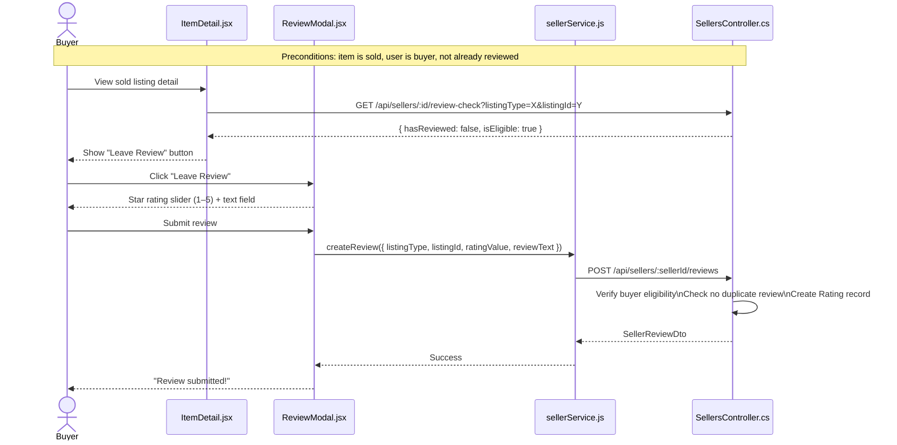
```mermaid
sequenceDiagram
    actor Buyer
    participant FE as ItemDetail.jsx
    participant RM as ReviewModal.jsx
    participant SS as sellerService.js
    participant BE as SellersController.cs

    Note over Buyer,BE: Preconditions: item is sold, user is buyer, not already reviewed

    Buyer->>FE: View sold listing detail
    FE->>BE: GET /api/sellers/:id/review-check?listingType=X&listingId=Y
    BE-->>FE: { hasReviewed: false, isEligible: true }
    FE-->>Buyer: Show "Leave Review" button
    Buyer->>RM: Click "Leave Review"
    RM-->>Buyer: Star rating slider (1–5) + text field
    Buyer->>RM: Submit review
    RM->>SS: createReview({ listingType, listingId, ratingValue, reviewText })
    SS->>BE: POST /api/sellers/:sellerId/reviews
    BE->>BE: Verify buyer eligibility\nCheck no duplicate review\nCreate Rating record
    BE-->>SS: SellerReviewDto
    SS-->>RM: Success
    RM-->>Buyer: "Review submitted!"
```

---

### 5.3 Admin Verify Seller

```mermaid
flowchart TD
    A([Admin on /admin → Users tab]) --> B[See user row with Verified status]
    B --> C[Click BadgeCheck toggle button]
    C --> D[PUT /api/users/:id { IsVerified: true/false }]
    D --> E[BE updates User.IsVerified]
    E --> F{IsVerified = true?}
    F -- Yes --> G[Gold VerifiedBadge appears on:\nall seller listings\nItemDetail seller name\nSellerProfile header]
    F -- No --> H[Badge removed from all locations]
```

---

## 6. Admin Dashboard

### 6.1 Data Loading

```mermaid
flowchart TD
    A([Admin navigates to /admin]) --> B{Role = admin?}
    B -- No --> C[Redirect to /]
    B -- Yes --> D[AdminPage.jsx loads]
    D --> E[Parallel data fetch]
    E --> F1[GET all users\nadminUsers.getAllUsers]
    E --> F2[GET /api/cues]
    E --> F3[GET /api/cue-cases]
    E --> F4[GET /api/billiardtables]
    E --> F5[GET /api/accessories]
    F1 & F2 & F3 & F4 & F5 --> G[Compute stat cards:\nTotal Users, Listings, Active, Sold,\nFlagged, Pending, Banned, Blocked Images]
    G --> H[Render Recharts:\nLine chart monthly, Pie+Bar by type]
    H --> I[Render tabs:\nListings / Users / Flagged / Banned]
```

---

### 6.2 Admin Actions

```mermaid
flowchart TD
    A[Admin Dashboard] --> B{Selected action}
    B -- Toggle verify user --> C[PUT /api/users/:id\n{ IsVerified: true/false }]
    B -- Ban user --> D[PUT /api/users/:id\n{ IsActive: false }]
    B -- Delete user --> E[DELETE /api/users/:id]
    B -- Edit user --> F[PUT /api/users/:id\n{ Name, Email, Role, ... }]
    B -- Flag listing --> G[PATCH /api/:type/:id/flag]
    B -- Delete listing --> H[DELETE /api/:type/:id]
    B -- Approve image --> I[PATCH /api/flagged-images/:id/approve]
    B -- Reject image --> J[PATCH /api/flagged-images/:id/reject]
```

---

## 7. Forum

### 7.1 Forum Flow

```mermaid
flowchart TD
    A([User clicks Forum in sidebar]) --> B{Authenticated?}
    B -- No --> C[Redirect to /login]
    B -- Yes --> D[Navigate to /forum]
    D --> E[GET /api/forum/categories]
    E --> F[Show category list]
    F --> G([User selects category])
    G --> H[GET /api/forum/categories/:id/discussions]
    H --> I[Show discussions list]
    I --> J([User opens discussion])
    J --> K[GET /api/forum/discussions/:id/posts]
    K --> L[Show posts thread]
    L --> M{User action}
    M -- Reply --> N[POST /api/forum/posts]
    M -- Like --> O[POST /api/forum/posts/:id/like]
    M -- Mark Helpful --> P[POST /api/forum/posts/:id/mark-helpful]
    M -- Edit own post --> Q[PUT /api/forum/posts/:id]
    M -- Delete own post --> R[DELETE /api/forum/posts/:id]
    M -- New discussion --> S[POST /api/forum/discussions]
```

---

## 8. Image Upload & NSFW Moderation

```mermaid
flowchart TD
    A([User uploads images in listing wizard]) --> B[POST /api/images/upload-multiple\nmultipart form data]
    B --> C[Backend receives image files]
    C --> D[Send to OpenNSFW/Nudenet\nport 8000]
    D --> E{NSFW score\nabove threshold?}
    E -- Yes --> F[Reject image\nReturn 400 with reason]
    F --> G([FE shows error:\nimage rejected])
    E -- No --> H[Save image to disk\npath: /uploads/date/filename]
    H --> I[Return imageUrl]
    I --> J([FE stores URL\nattaches to listing on save])
    J --> K{Flagged later\nby moderator?}
    K -- Yes --> L[FlaggedImage record created\nstatus: pending]
    L --> M[Admin reviews in\nFlagged Images tab]
    M --> N{Decision}
    N -- Approve --> O[Image stays live]
    N -- Reject --> P[Image hidden/removed]
```

---

## 9. System Notifications

```mermaid
flowchart TD
    A{Event trigger} --> B1[Raffle winner drawn]
    A --> B2[Offer accepted]
    A --> B3[Offer rejected]
    A --> B4[Counter offer received]
    B1 --> C[Message created:\nmessageType: system\nisSystem: true\nrecipientId: winnerId]
    B2 & B3 & B4 --> D[Message created:\nmessageType: accepted/rejected/counter_offer\nrecipientId: buyerId]
    C & D --> E[Stored in Messages table]
    E --> F[Unread count incremented]
    F --> G[FE polling picks up new count\nwithin 10 seconds]
    G --> H([Badge shown on Inbox icon])
    H --> I([User opens Inbox → sees notification])
```

---

## 10. App Initialization Sequence

```mermaid
sequenceDiagram
    participant Browser
    participant App as App.js
    participant AC as AuthContext.js
    participant BE as Backend APIs

    Browser->>App: Load app
    App->>AC: Read localStorage[authToken]
    alt Token exists
        AC-->>App: user = { id, username, role, ... }
        App->>BE: GET /api/messages/inbox?unreadOnly=true
        BE-->>App: unreadCount
        App->>App: Set unreadMessageCount
        App->>BE: GET /api/forum/categories
        BE-->>App: forumCategories
        App->>App: Start 10s unread polling loop
        App->>App: After 2s: checkOldListings()
    else No token
        AC-->>App: user = null
    end
    App->>BE: GET /api/cues + /api/cue-cases + /api/billiardtables + /api/accessories
    BE-->>App: All listings
    App-->>Browser: Render CueList with listings
```
